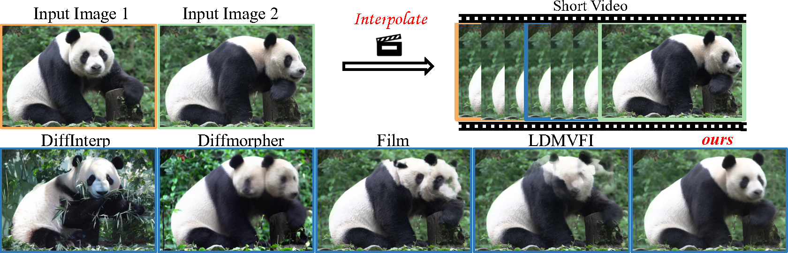

<p align="center">
  <h1 align="center">DreamMover: Leveraging the Prior of Diffusion Models for Image Interpolation with Large Motion</h1>
  <p align="center">
    <a href="https://leoshen917.github.io/"><strong>Liao Shen</strong></a>
    &nbsp;&nbsp;
    <a href="https://tqtqliu.github.io/"><strong>Tianqi Liu</strong></a>
    &nbsp;&nbsp;
    <a href="https://huiqiang-sun.github.io/"><strong>Huiqiang Sun</strong></a>
    &nbsp;&nbsp;
    <a href="https://scholar.google.com/citations?user=g_Y0w7MAAAAJ&hl"><strong>Xinyi Ye</strong></a>
    &nbsp;&nbsp;
    <a href="https://orcid.org/0000-0002-9032-3991"><strong>Baopu Li</strong></a>
    &nbsp;&nbsp;
    <a href="https://jimmie33.github.io/"><strong>Jianming Zhang</strong></a>
    &nbsp;&nbsp;
    <a href="http://english.aia.hust.edu.cn/info/1085/1528.htm"><strong>Zhiguo Cao<sep>✉</sep></strong></a>
  </p>
  <p align="center">
    <sep>✉</sep>Corresponding Autor
  </p>

  <div align="center">
        
  </div>
</p>

## Installation
```
git clone https://github.com/leoShen917/DreamMover.git
cd DreamMover
conda create -n mover python=3.8.5
conda activate mover
pip install -r requirement.txt
```
You can download the pretrained model Stable Diffusion v1.5 from [Huggingface](https://huggingface.co/runwayml/stable-diffusion-v1-5), and specify the `model_path` to your local directory.

[Optional] You can download the fine-tuned vae model from [Huggingface](https://huggingface.co/stabilityai/sd-vae-ft-mse) for better performance.

## Run Gradio UI
To start the Gradio UI of DreamMover, run the following in your environment:
```bash
python gradio_ui.py
```
Then, by default, you can access the UI at [http://127.0.0.1:7860](http://127.0.0.1:7860).

<div align="center">
  
</div>

## Usage
To start with, run the following command to train a Lora for image pair:
```
python lora/train_dreambooth_lora.py --pretrained_model_name_or_path [model_path] --instance_data_dir [img_path] --output_dir [lora_path] --instance_prompt [prompt] --lora_rank 16
```

After that, we now can run the main code:
```
python main.py \
  --prompt [prompt] --img_path [img_path] --model_path [model_path] --vae_path [vae_path] --lora_path [lora_path] --save_dir [save_dir]
```
The script also supports the following options:
- `--prompt`: Prompt of the image pair(default: "")
- `--img_path`: Path of the image pair
- `--model_path`: Pretrained model path (default: "runwayml/stable-diffusion-v1-5")
- `--vae_path`: vae model path (default= "default")
- `--lora_path`: lora model path (the output path of train_lora)
- `--save_dir`: path of the output images (default= "./results")

## Acknowledgement
This code borrows heavily from [DragDiffusion](https://github.com/Yujun-Shi/DragDiffusion), [DiffMorpher](https://github.com/Kevin-thu/DiffMorpher) and [Diffusers](https://github.com/huggingface/diffusers). We thank the respective authors for open sourcing their method.